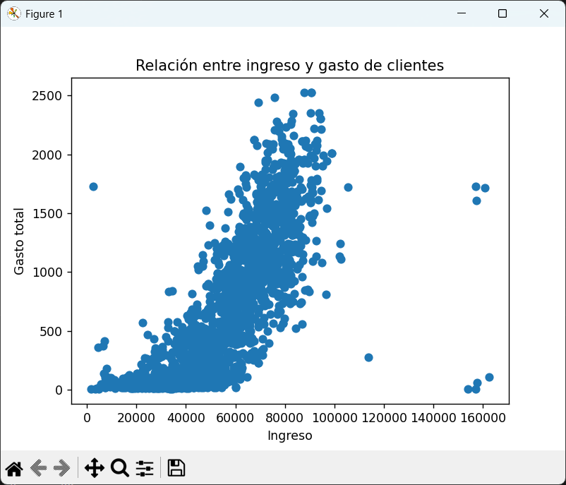
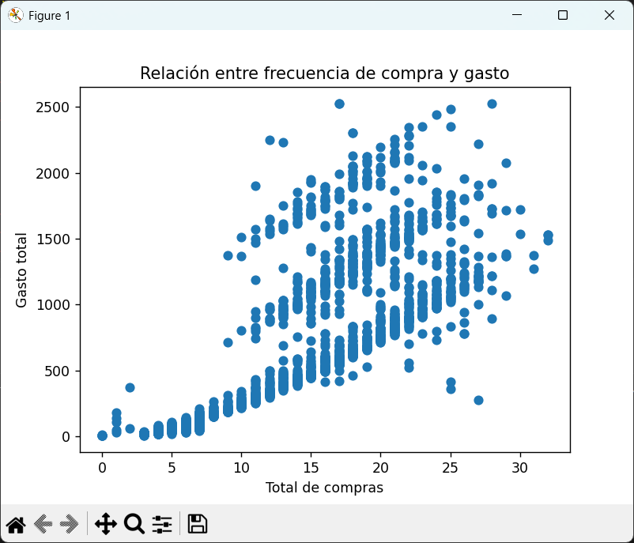
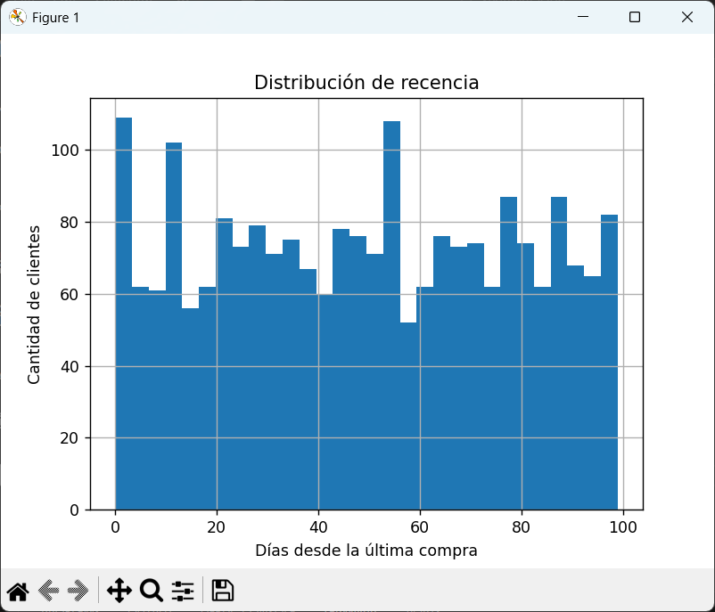
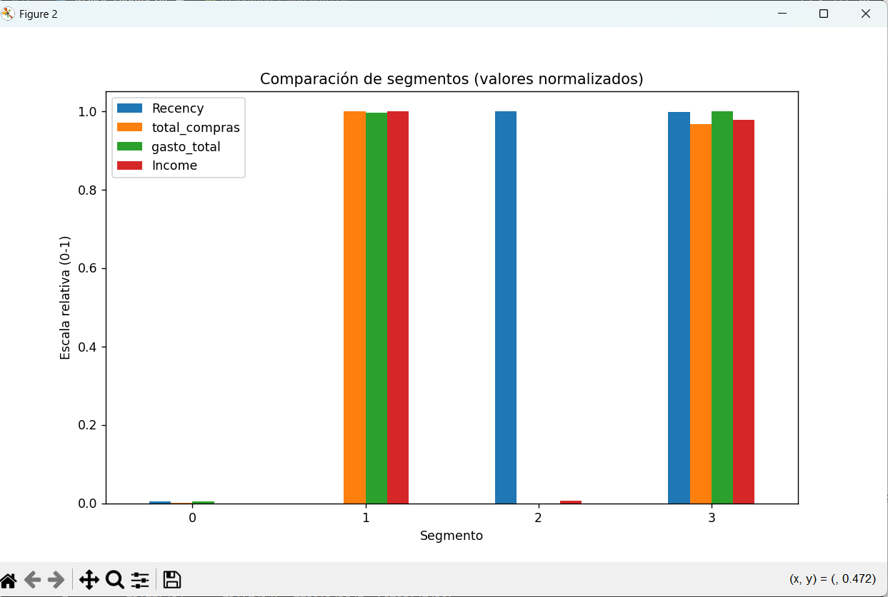
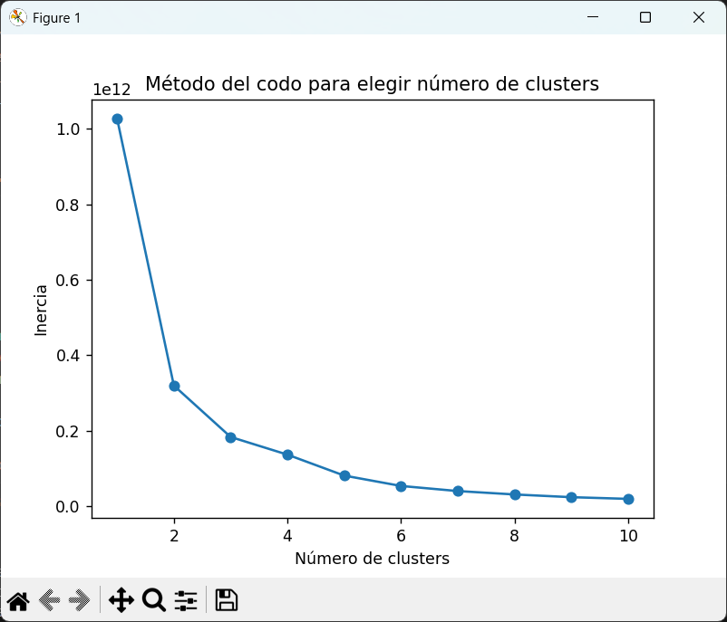

# Segmentación de clientes para optimizar campañas de marketing con RFM y K-Means

---

## Visualizaciones

## Relación entre ingreso y gasto
Este gráfico muestra cómo se relaciona el ingreso anual de los clientes con su gasto total en productos. Permite observar si los clientes con mayores ingresos tienden a gastar más dentro de la empresa.



## Relación entre frecuencia de compra y gasto
Este gráfico muestra la relación entre la cantidad de compras realizadas por los clientes y su gasto total. Permite identificar patrones de comportamiento y distinguir entre clientes que compran frecuentemente y aquellos que realizan pocas compras pero de mayor valor.



## Distribución de recencia
Este histograma muestra la distribución de clientes según la cantidad de días desde su última compra. Es útil para identificar qué proporción de clientes compró recientemente y cuántos llevan mucho tiempo sin comprar.



## Segmentación de clientes
Este gráfico muestra los segmentos de clientes identificados por el modelo de clustering K-Means. Cada color representa un grupo de clientes con comportamientos de compra similares en términos de frecuencia y gasto.



## Método del codo
Este gráfico utiliza el método del codo para determinar el número óptimo de clusters en el modelo.



---

## Descripción del proyecto

Este proyecto analiza el comportamiento de compra de clientes y los agrupa en distintos segmentos utilizando **análisis RFM** y **clustering con K-Means.**

El objetivo es identificar diferentes tipos de clientes para ayudar a las empresas a diseñar estrategias de marketing más efectivas, como programas de fidelización, campañas de reactivación o estrategias de retención.

El dataset utilizado corresponde a una base de datos de **campañas de marketing**, que contiene información sobre ingresos, historial de compras y comportamiento de clientes.

---

## Problema de negocio

Las empresas suelen tener miles de clientes con comportamientos muy diferentes. Tratar a todos los clientes de la misma manera suele generar campañas de marketing poco efectivas.

La segmentación de clientes permite responder preguntas como:

* ¿Quiénes son nuestros **clientes más valiosos**?

* ¿Qué clientes **dejaron de comprar recientemente**?

* ¿Qué clientes **compran poco**?

* ¿Qué clientes deberían recibir **campañas de reactivación**?

Este proyecto busca identificar grupos de clientes con comportamientos similares para mejorar la toma de decisiones comerciales.

---

## Dataset

El dataset incluye información sobre:

* Ingresos de los clientes

* Gasto en distintos productos

* Frecuencia de compra

* Recencia de compra (días desde la última compra)

* Comportamiento frente a campañas de marketing

Variables principales utilizadas para la segmentación:

| **Variable**      | **Descripción**                          |
| ------------- | ------------------------------------ |
| Recency       | Días desde la última compra          |
| total_compras | Cantidad total de compras realizadas |
| gasto_total   | Gasto total acumulado                |
| Income        | Ingreso anual del cliente            |

---

## Ingeniería de variables

Se crearon nuevas variables a partir del dataset original.

### Gasto total del cliente

```bash
gasto_total =
    MntWines +
    MntFruits +
    MntMeatProducts +
    MntFishProducts +
    MntSweetProducts +
    MntGoldProds
```
### Frecuencia de compra

```bash
total_compras =
    NumWebPurchases +
    NumCatalogPurchases +
    NumStorePurchases
```

Estas variables representan los componentes Monetary y Frequency del análisis RFM.

---

## Metodología
### Análisis RFM

RFM es una técnica ampliamente utilizada en marketing para analizar el comportamiento de los clientes.

Se basa en tres variables clave:

| **Métrica**   | **Significado**                           |
| --------- | ------------------------------------- |
| Recency   | Qué tan reciente fue la última compra |
| Frequency | Qué tan seguido compra el cliente     |
| Monetary  | Cuánto dinero gasta el cliente        |

Clientes con alta frecuencia y alto gasto suelen ser considerados **clientes de alto valor**

---

### Escalado de datos

Antes de aplicar el modelo de clustering, las variables fueron normalizadas utilizando **StandardScaler**, para evitar que variables con valores más grandes influyan demasiado en el modelo

---

### Clustering con K-Means

Se utilizó el algoritmo **K-Means** para agrupar clientes con comportamientos similares.

Para determinar la cantidad adecuada de clusters se utilizó el **método del codo (Elbow Method)**, analizando cómo cambia la inercia del modelo al aumentar el número de clusters.

---

## Resultados

El modelo identificó **cuatro segmentos principales de clientes**.

### Segmento 0 — Clientes de bajo valor

* Pocas compras

* Gasto bajo

* Ingresos bajos

Clientes que aportan poco al ingreso total de la empresa.

---

### Segmento 1 — Clientes VIP

* Alta frecuencia de compra

* Gasto elevado

* Ingresos altos

Representan el grupo de mayor valor para la empresa.

---

### Segmento 2 — Clientes dormidos

* Hace mucho tiempo que no compran

* Gasto histórico bajo

Clientes que probablemente abandonaron la marca.

---

### Segmento 3 — Clientes valiosos en riesgo

* Gasto histórico alto
* Hace tiempo que no compran

Estos clientes representan oportunidades importantes de **reactivación**.

---

## Visualizaciones incluidas

El proyecto incluye distintos gráficos exploratorios:

* Relación entre ingresos y gasto

* Relación entre frecuencia de compra y gasto

* Distribución de recencia

* Visualización de clusters de clientes

* Comparación del perfil promedio de cada segmento

* Gráfico del método del codo

---

## Posibles aplicaciones de negocio

La segmentación permite diseñar estrategias específicas para cada grupo de clientes.

| **Segmento**               | **Estrategia**                |
| ---------------------- | ------------------------- |
| Clientes VIP           | Programas de fidelización |
| Clientes en riesgo     | Campañas de reactivación  |
| Clientes dormidos      | Campañas de recuperación  |
| Clientes de bajo valor | Promociones básicas       |

---

## Tecnologías utilizadas

* Python

* Pandas

* Scikit-learn

* Matplotlib

---

## Cómo ejecutar el proyecto

Clonar el repositorio:
```bash
git clone https://github.com/tuusuario/segmentacion-clientes
```
Instalar dependencias:
```bash
pip install pandas matplotlib scikit-learn
```
Ejecutar el análisis:
```bash
python analisis_clientes.py
```

---

## Estructura del proyecto
```bash
segmentacion-clientes
│
├── marketing_campaign.csv
├── analisis_clientes.py
├──Imagenes
└── README.md
```

---

# Autor

**Lautaro Luchesi**

Actualmente desarrollando proyectos de portafolio orientados a:

- Limpieza y análisis de datos
- SQL
- Python (Pandas)
- Visualización de datos

LinkedIn:  
https://www.linkedin.com/in/lautaro-luchesi-1b5819329/
